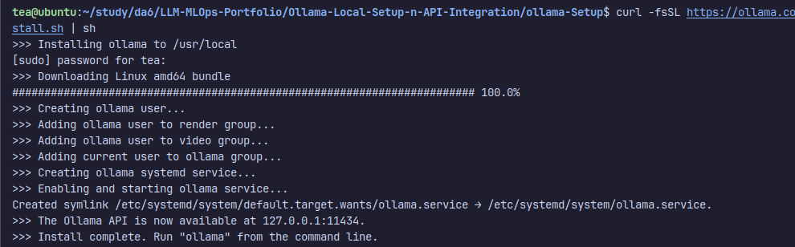
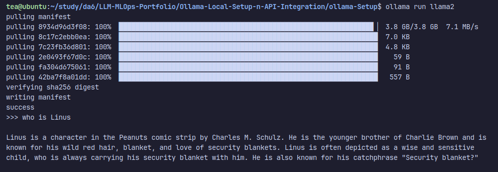

### Set Up Ollama Locally
Install Ollama: curl -fsSL https://ollama.com/install.sh | sh

(I have my other window laptop with nvidia card 
but Ollama is not allowed to be there during exam 
so I use this laptop huhu)

Download a Model: ollama pull llama2
To test: ollama run llama2 (super SLOW here in my HP probook without nvidia)

### Create Ollama Chatbot Script
Install Ollama Python Library: pip install ollama

### Test 5 prompts with both online and Ollama models, compare results.